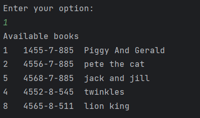

# Library
This application allows user information about:

1)All available books

2)All Checked out books and name

3)Check In books

## Interesting code

The interesting code is the implementation of displayHomeScreen loop and the program allows the user to know the check in and checked out details.

The program uses Switch method to initialise user input

public static void displayHomeScreen() {
boolean display = true;
while (display) {
System.out.println();
System.out.println("Welcome to the Library");
System.out.println("what do you want to do?");
System.out.println("1)Display available Books");
System.out.println("2)Show checked out books");
System.out.println("3)Check in a book");
System.out.println("4)Exit");
System.out.println("Enter your option:");
int selection = scanner.nextInt();
scanner.nextLine();

switch (selection) {
case 1:
System.out.println("Available books");
for (BookClass book : books) {
System.out.printf("%d\t%s\t%s\n", book.getId(), book.getIsbn(), book.getTitle());
}
while (!display) {
System.out.println("Enter the title of the book you want to check out:");
selection = scanner.nextInt();
displayHomeScreen();
}
break;

                case 2:
                    selection = 2;
                    System.out.println("Checked Out Books");
                    for (BookClass book : books) {
                        if (book.getisCheckedOut()) {
                            System.out.printf("%d\t%s\t%s\t%s\n", book.getId(), book.getIsbn(), book.getTitle(), book.getCheckedOutTo());
                            selection = scanner.nextInt();
                            displayHomeScreen();
                        }
                    }
                    break;
                case 3:
                    selection = 3;
                    System.out.println("Check in a Book");
                    System.out.println("Enter the book Id you want to check in");
                    for (BookClass book : books) {
                        if (book.getId() == selection)
                            if (book.getisCheckedOut()) {
                                display = true;
                                System.out.printf("'%s'\t is checked in\n", book.getTitle());
                                book.checkIn();
                                selection = scanner.nextInt();
                                displayHomeScreen();

                            }
                    }
                    break;
                case 4:
                    selection = 4;
                    System.out.println("Exit");
                    display = true;
                    displayHomeScreen();
### CLI Screens
#### Home Screen

#### Checked Out Books

